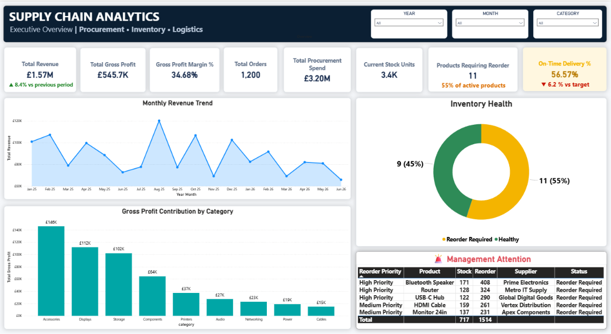
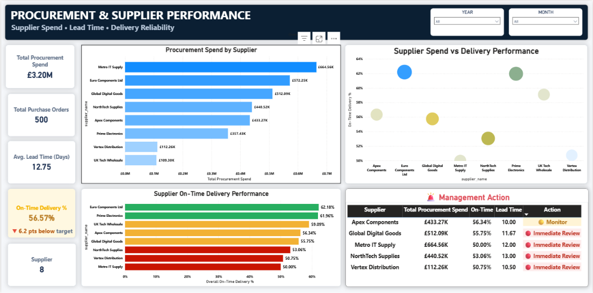
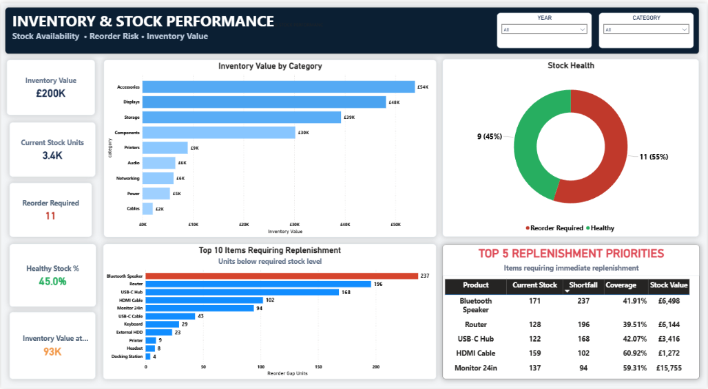
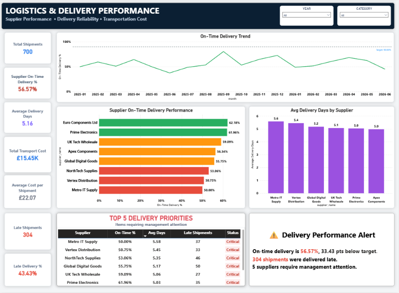
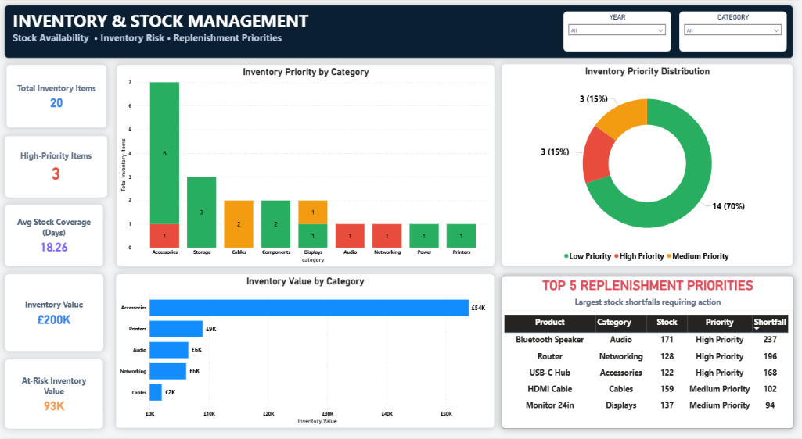
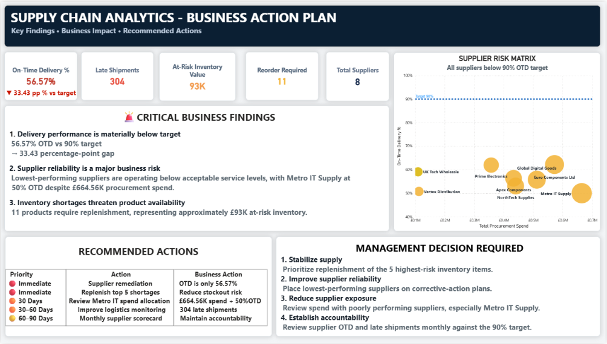

<div align="center">

# 📦 SUPPLY CHAIN ANALYTICS

### From Operational Data → Business Insights → Management Action

<p>
  
  
  
  
</p>

<p>
  
  
  
</p>

<br>

> **An end-to-end Supply Chain Analytics solution built to identify operational risks,  
> quantify business impact, and translate analytics into management actions.**

<br>

[📊 Dashboard](#-dashboard) •
[🚨 Business Findings](#-business-findings) •
[🎯 Recommendations](#-management-recommendations) •
[🧮 DAX](#-dax--business-logic) •
[🗄️ SQL](#-sql--data-analysis) •
[📁 Repository](#-repository-structure)

</div>

---

# 🏢 Business Context

Supply chain teams need to answer more than:

> "What happened?"

They need to know:

- Where is performance deteriorating?
- Which suppliers require intervention?
- Which products are at risk of stockout?
- Where is procurement spend concentrated?
- Why are shipments arriving late?
- What should management do next?

This project was designed around those questions.

The solution combines:

**Revenue → Procurement → Suppliers → Inventory → Replenishment → Logistics**

into one integrated analytical environment.

---

# 🚨 Executive Snapshot

| KPI | Current Position | Business Signal |
|---|---:|---|
| 🚚 On-Time Delivery | **56.57%** | 🔴 6.2 pts below 90% target |
| ⏰ Late Shipments | **304** | 🔴 Significant service risk |
| 📦 Products Requiring Reorder | **11** | 🔴 Availability risk |
| 💷 At-Risk Inventory Value | **£93K** | 🟠 Working-capital exposure |
| 🛒 Procurement Spend | **£3.20M** | 🟠 Supplier concentration |
| 🤝 Suppliers | **8** | 🔵 Material performance variation |
| 📦 Inventory Items | **20** | 🔵 Portfolio-wide visibility |

---

# 📊 Dashboard

The Power BI report contains **six decision-focused pages**.

Each page answers a specific business question rather than simply displaying charts.

---

## 01 · Executive Overview

### Business Question
**How healthy is the supply chain overall?**



### Focus

- Revenue & profitability
- Procurement spend
- Inventory health
- Delivery reliability
- Reorder exposure
- Management attention

---

## 02 · Procurement & Supplier Performance

### Business Question
**Which suppliers require commercial or operational intervention?**



### Focus

- Supplier spend
- Supplier OTD %
- Average lead time
- Supplier performance
- Supplier risk
- Management action

---

## 03 · Inventory & Stock Performance

### Business Question
**Where is inventory tied up and where are stock risks emerging?**



### Focus

- Inventory value
- Stock health
- Reorder requirements
- Stock shortfall
- Replenishment priorities

---

## 04 · Logistics & Delivery Performance

### Business Question
**Where is delivery performance breaking down?**



### Focus

- Shipment reliability
- On-time delivery
- Late shipments
- Average delivery days
- Supplier performance
- Transportation cost

---

## 05 · Inventory & Stock Management

### Business Question
**Which products need action first?**



### Focus

- Inventory priority
- Priority distribution
- Stock coverage
- Inventory value
- Top-5 replenishment priorities

---

## 06 · Business Findings & Recommendations

### Business Question
**What should management do next?**



### Focus

- Key business findings
- Risk prioritization
- Financial / operational impact
- Recommended actions
- Ownership
- Management urgency

---

# 🔎 Business Findings

## 1. 🚚 Delivery Reliability Is the Primary Operational Risk

Current on-time delivery is:

### **56.57%**

against a:

### **90% target**

with:

### **304 late shipments**

This represents the most significant operational weakness identified in the analysis.

### Business impact

Poor delivery reliability can affect:

- Customer service
- Production planning
- Inventory availability
- Supplier relationships
- Working capital
- Overall service levels

---

## 2. 🤝 Supplier Performance Is Uneven

Supplier on-time delivery performance ranges from approximately:

**50% → 62%**

This creates a significant difference in operational reliability.

The highest concern is not simply poor OTD.

It is the combination of:

> **High procurement spend + weak delivery performance**

Suppliers matching this profile should receive immediate management attention.

---

## 3. 📦 Inventory Requires Targeted Intervention

The analysis identifies:

- **11 products requiring reorder**
- Approximately **£93K of at-risk inventory value**

Management should avoid treating every SKU equally.

Instead, replenishment should prioritize:

**Stock Shortfall × Business Value × Priority**

---

## 4. 💷 Procurement Concentration Creates Exposure

Total procurement spend is approximately:

### **£3.20M**

Metro IT Supply represents the largest supplier spend while also demonstrating weak delivery reliability.

This creates a potential concentration risk.

Management should evaluate:

- Supplier diversification
- Negotiated service-level agreements
- Backup suppliers
- Allocation of future purchase volume

---

## 5. 🚛 Logistics Needs SLA-Level Management

A single OTD percentage cannot fully explain delivery problems.

The analysis should be monitored using:

- Promised delivery days
- Actual delivery days
- On-time status
- Late shipment volume
- Supplier performance
- Transportation cost

This allows management to distinguish between:

**Supplier problem → Logistics problem → Planning problem**

---

# 🎯 Management Recommendations

| Priority | Recommendation | Owner | Timing |
|---|---|---|---|
| 🔴 1 | Launch corrective-action plans for weakest supplier performers | Procurement | Immediate |
| 🔴 2 | Expedite Top-5 replenishment priorities | Supply Planning | Immediate |
| 🟠 3 | Review high-spend / low-service supplier dependency | Procurement | 30–60 days |
| 🟠 4 | Review logistics and shipment SLA performance | Logistics | 30 days |
| 🔵 5 | Establish monthly executive supply-chain scorecard | Operations | Monthly |

---

## Recommended Management Sequence

```text
                    IDENTIFY
                       │
                       ▼
            🔴 DELIVERY RELIABILITY
                       │
                       ▼
             🔴 SUPPLIER INTERVENTION
                       │
                       ▼
          🔴 PROTECT INVENTORY AVAILABILITY
                       │
                       ▼
            🟠 DIVERSIFY / RENEGOTIATE
                       │
                       ▼
              🟠 IMPROVE LOGISTICS
                       │
                       ▼
               🔵 MONITOR KPIs


```
## 👤 Author
<div align="center">
Yash Prajapati
Data Analytics • Power BI • SQL • DAX

Building business-focused analytics solutions that connect:

Data → Insight → Action

<br>    </div>


<div align="center">
⭐ Supply Chain Analytics

From operational data to management action.

If you find this project useful, consider giving the repository a ⭐

</div> 

